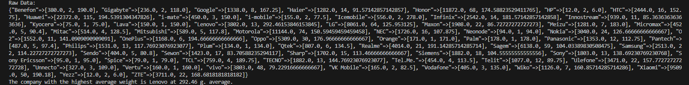

# COP4020-Alternative Language Project

---

## The Language
The programming language I chose for this project was Ruby 3.2.3. The reason I chose this specific language was due to a mixture of curiosity about the language itself and I wanted a language that utilizes OOP so that my time learning othe rlanguages such as Java and C++ could assist me. Even before I took this class, I had heard about some of the attributes of Ruby and became curious about it such as how almost everything is an object. After hearing about Ruby more throughout the course of the class, this project gave me the push I needed to learn and use it for something. The verson I chose was because it happened to be the newest version and I didn't know enough about Ruby to pick a different version

## Ruby Attributes 
- Object-Oriented Programming: Ruby is an OOP language so it contains all of the typical attributes that are associated with it such as classes, polymorphism, encapsulation, etc. The main thing that sets Ruby apart from most other OOP languages is that all data are considered as objects within the language. One way this affects the language is with working with variables. Since all of the data are considered objects, we end up working with object references throughout the code. This also means all parameters passed to methods are passed by value and can't be changed within the method.

- File Ingestion: Since Ruby has all data considered as objects within it, File passing is also done through an object. By creating a new file object and passing the name of the file as a parameter, we are able to read from, modify, and write to the file among other things. There is also the option of using the class methios directly to read from the file and then using that output in a different method such as the CSV.parse method present in the program.

- Conditional Statements: Ruby has the traditional conditional statements that are present in most languages such as if, else, and their version of the switch statement called case. A unique conditional keyword is "unless" which is a fast way of executing a piece of code if the condition is false. Each conditional statement must finish with the end keyword for fatal errors not to occur.

- Assignment Statements: All of the basic assignment statement structures that are expected are also in Ruby. However, Ruby has support for a couple features beyond the basic assignment statement with one of these being multi target/source assignemnts. Something neat about Ruby is that all assignment operators are implemented as method so they can be overidden by program methods. 

- Loops: Ruby has support for a variety of basic loops from those present in most languages such as the while and for loop to those that are more specific such as the until loop which runs until the condition is false. Ruby also allows use of the while and until loop keywords as modifiers to the end keyword that is put at the end of each loop and decision structure. Ruby also supports in-loop control using keywords such as break, next, retry, and redo thus allowing a developer more control over the execution of loops.

- Subprograms: As an OOP language, Ruby has support for subprograms such as functions/methods regardless if they are part of a class or not. Methods that are part of a class can be called using the dot operator on an instance of that class, but Ruby provides another option as well. Using the self keyword before the name of the program will allow calling it using the name of the class itself. All subprogram parameters are passed-by-assignment since the data values are all objects thus there can't be any changing of parameters like what can be done with pass by reference. 

- Unit Testing: Ruby has built-in support for unit testing through the [Test::Unit](https://ruby-doc.org/stdlib-3.1.0/libdoc/test-unit/rdoc/Test/Unit.html) library that is included within the standard library. The tests in Ruby are on par with other languages with built-in tests; letting you assert conditions, make collection of tests called suites, and run the tests using various runners such as the console or GTK+ runners.

- Exception Handling: Exceptions can be handeled through the standard livrary without needing to import anything extra. Like most things in Ruby, they are objects and the program comes with many predefined exceptions. Similiar to other languages, we watch for exceptions by wrapping the code within a begin/end keyword block and use rescue to catch exceptions and decide how to handle them. The user can make their own exceptions but they must be a subclass of the StandardException class or one of its subclasses.

## Libraries Used 
I did not use many external libraries in this program, so this section will list the includes from the standard library that I had to do.

1. [CSV](https://ruby-doc.org/stdlib-3.0.0/libdoc/csv/rdoc/CSV.html): A built-in library that allows for the parsing and modification of csv files. This was used in the program to import the data from the csv file into a format (CSV::Table) that was easier to work with. The CSV Table then was iterated through to sanitize the data and put the classes into a hash. I chose this function to use as it made importing and working with the .csv data file simple.

2. [Active Support](https://www.rubydoc.info/gems/activesupport): The only truely external library used in the program, Active Support is a collection of utility classes and extensions that were originally bundled with the ruby on rails framework. This gem(addon) was developed as a way for non rails projects to use these extensions. Its main use in the program was importing the blank? function which not only checks if the function only has whitespace, but also checks for a nil value as well.

3. [Test::Unit](https://ruby-doc.org/stdlib-3.1.0/libdoc/test-unit/rdoc/Test/Unit.html): Included within the standard library, this library gives support for unit tests within the function. As may be obvious from the name, I mainly used this in order to create and run unit tests throughout the program. I chose this as my way to do unit tests as it is included within the standard library and thus needed no additional installs.

4. [Bundler/Inline](https://bundler.io/docs.html): Included with installs of Ruby, bundler allows for the installation and maintaining of extensions and add-ons called Gems. This is used in the program in order to make sure that the Active Support gem and its dependencies are installed. This is mainly used to ensure support with replit where this program is being ran, but it also allows for any ruby IDE to run it without needing to install gems before hand. This comes at a cost of massively increased runtime on first run and a noticable delay on future runs afterwards.

## Answer to Questions
- What company (oem) has the highest average weight of phone body?

The company with the highest average weight is Lenovo at 292.46 g. average

- Was there any phones that were announced in one year and released in another? What are they? Give me the oem and models.

    

4 phones were announced and released in different years 
    
     OEM: Motorola, Model: One Hyper
     OEM: Motorola, Model: Razr 2019
     OEM: Xiaomi, Model: Redmi K30 5G
     OEM: Xiaomi, Model: Mi Mix Alpha

- How many phones have only one feature sensor?

    There are 432 phones with only one feature sensor.

- What year had the most phones launched in any year later than 1999?

    2019 had the most phones released at 299

